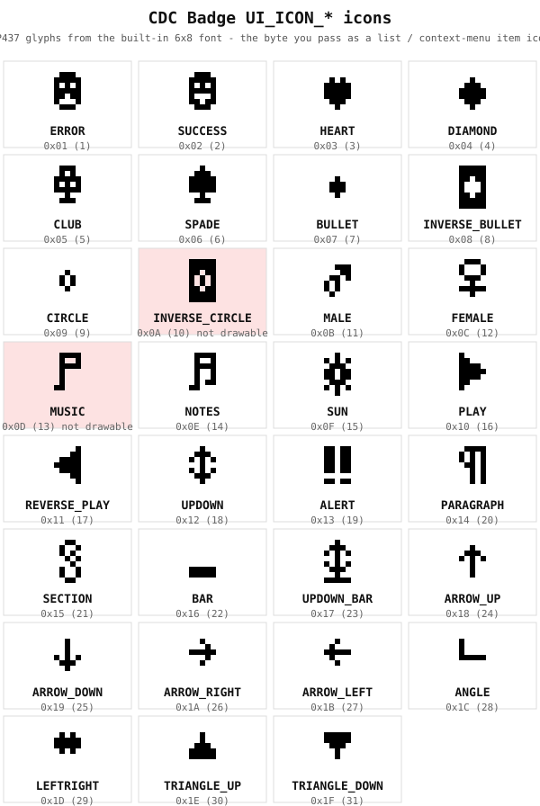
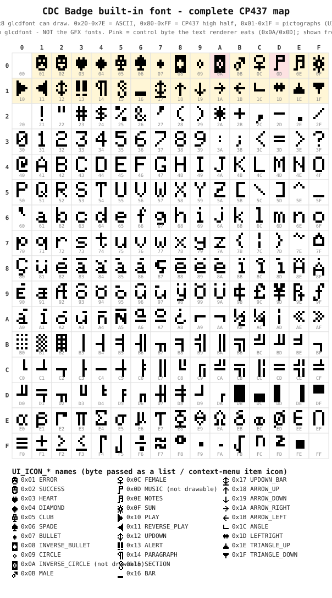

This page documents the host API contract that the firmware exposes to plugins.
It is built directly from the canonical header
`components/plugin_manager/include/plugin_manager/host_api.h` and the WAMR symbol
table in `components/plugin_manager/src/WamrImports.cpp`.

Every function listed here is both declared in `host_api.h` and registered in the
symbol table: the two sets match exactly (a clean bijection), so there are no
declared-but-unimplemented stubs. For the full signatures,
parameters and return semantics, generate and read the [Doxygen reference](/api/host__api_8h.html).

For the plugin model, manifest schema and lifecycle, see the
[Plugin SDK & manifest](/dev/plugin-sdk/) page.

## API level

The API level constants are defined in `host_api.h`:

| Constant | Value | Source |
| --- | --- | --- |
| `HOST_API_LEVEL_MAJOR` | 0 | `host_api.h:28` |
| `HOST_API_LEVEL_MINOR` | 7 | `host_api.h:29` |
| `HOST_API_LEVEL_STR` | `"0.7"` | `host_api.h:30` |
| `HOST_API_LEVEL_PACKED` | `(major << 16) \| minor` | `host_api.h:31` |

A plugin declares `host_api_level_min` in its manifest. At load the firmware
requires the plugin major to equal the firmware major and the plugin minor to be
less than or equal to the firmware minor; otherwise the plugin is rejected with
an API-level mismatch (`CapabilityChecker.cpp:44-49`).

## Return codes

All fallible host functions return an `int` status. The codes are
(`host_api.h:37-46`):

| Code | Value | Meaning |
| --- | --- | --- |
| `HOST_OK` | 0 | Success |
| `HOST_ERR_GENERIC` | -1 | Unspecified failure |
| `HOST_ERR_INVALID_ARG` | -2 | Bad argument (includes failed pointer validation) |
| `HOST_ERR_NO_CAPABILITY` | -3 | Required manifest capability not declared |
| `HOST_ERR_NOT_FOUND` | -4 | Resource or key not found |
| `HOST_ERR_TIMEOUT` | -5 | Operation timed out |
| `HOST_ERR_NO_MEMORY` | -6 | Allocation failed |
| `HOST_ERR_BUSY` | -7 | Resource in use / conflicting claim |
| `HOST_ERR_NOT_SUPPORTED` | -8 | Operation not supported |
| `HOST_ERR_RMEM_FULL` | -9 | Retained-memory pool exhausted |

Functions that return a count or handle return a non-negative value on success
and a negative `HOST_ERR_*` on failure; handle-returning functions (HTTP, socket)
return a handle greater than zero.

## UTF-8 boundary

The whole host API speaks UTF-8. Text passed to UI, canvas and display functions
is converted to the display codepage internally, and text read back
(`host_ui_consume_input_text`, `host_view_canvas_get_text`) is returned as UTF-8
(`host_api.h:1414-1424`). Plugins normally never convert anything themselves.

For message transfer, payload bytes are opaque and not converted; for text MIME
types they are UTF-8 (`host_api.h:1336-1339`). `host_msg_send_interactive` and
`host_msg_send` take a `flags` argument; passing `HOST_MSG_FLAG_PERSIST` opts the
transfer into a session-persistent pairing, so repeated sends to the same peer
(e.g. a messenger) confirm the numeric-comparison code only once per power
session. Two optional helpers, `host_str_to_display` and `host_str_to_utf8`,
exist for advanced cases such as pre-rendering to a specific codepage; do not
feed their output back into the auto-converting UI functions
(`host_api.h:1428-1454`).

## Symbols and icons

The display font is the built-in 6x8 Adafruit-GFX glyph set, which is the full
IBM-PC code page 437 (CP437). The two charts below are rendered straight from the
firmware's `components/Adafruit-GFX/glcdfont.c`, so they match the panel exactly
(regenerate with `python3 tools/gen_symbol_chart.py`).

The named pictographs (`UI_ICON_*`, bytes 0x01-0x1F):

The complete CP437 code page (every byte 0x00-0xFF):

There are two ways to put a symbol on screen:

- **As a list / context-menu item icon.** Pass the byte in the item's `icon`
  field. The `UI_ICON_*` names are the CP437 bytes 0x01-0x1F
  (`host_api.h:747-790`); `UI_ICON_NONE` (0) draws a default bullet. Toast /
  message / confirm views only honor a small fixed icon set (`host_api_ui.cpp`);
  other values fall back to no icon there.
- **In text** (UI strings and `host_view_canvas_draw_text`). Pass the glyph's
  normal Unicode character; the UTF-8->CP437 converter maps it to the right byte
  (`Cp437.cpp` `fromUnicode`): `♥` (U+2665) becomes 0x03, `→` (U+2192) becomes
  0x1A, the CP437 high half (accents, box-drawing, Greek, maths) maps via the
  `kHigh` table, and ASCII passes straight through. Two pictographs cannot be
  drawn as text - `0x0A` (U+25D9) and `0x0D` (U+266A) - because the text renderer
  consumes those bytes as newline / carriage-return; they are reachable only as
  the bitmap shown in the chart.

## Function families

Each family is a Doxygen `\defgroup` in `host_api.h` with a matching
`host_api_<family>.cpp` implementation. The table below lists the family, the
manifest capability it requires (if any), and a few representative functions. It
is not exhaustive; consult `host_api.h` or the [Doxygen reference](/api/host__api_8h.html) for the
complete set.

The "Capability" column reflects what is enforced at the host-call boundary
(`HOST_ERR_NO_CAPABILITY`), not just what is documented.

| Family | Capability | Representative functions |
| --- | --- | --- |
| Logging | none | `host_log`, `host_log_hex` |
| Time / RTC | none | `host_uptime_ms`, `host_unix_time`, `host_local_time`, `host_is_time_set` |
| Power | none | `host_battery_pct`, `host_power_source`, `host_charge_status`, `host_set_sleep_inhibit` |
| Crypto | none | `host_random`, `host_sha256`, `host_hmac_sha256`, `host_aes_gcm_encrypt`, `host_base64_encode` |
| SecureElement / TROPIC01 | `rmem`, `ecc` (named slots) | `host_rmem_read_named`, `host_rmem_write_named`, `host_ecc_generate`, `host_ecdsa_sign`, `host_eddsa_sign` |
| HTTP | `http` (manifest only, see note) | `host_http_open`, `host_http_set_header`, `host_http_perform`, `host_http_read_chunk`, `host_http_close` |
| Socket | `socket` | `host_socket_open`, `host_socket_write`, `host_socket_read`, `host_socket_close` |
| WiFi | `wifi` (manifest only, see note) | `host_wifi_request`, `host_wifi_is_connected`, `host_wifi_start_scan`, `host_wifi_scan_results` |
| BLE | `ble` | `host_ble_register_service`, `host_ble_send_notification`, `host_ble_scan_start`, `host_ble_connect`, `host_ble_subscribe` |
| NVS (plugin-namespaced) | none | `host_nvs_get_blob`, `host_nvs_set_blob`, `host_nvs_get_u32`, `host_nvs_erase_all` |
| vFAT (sandboxed files) | `vfat` | `host_fs_write`, `host_fs_read`, `host_fs_remove`, `host_fs_list`, `host_fs_view`, `host_fs_view_image`, `host_fs_view_markdown` |
| UI - Views | none | `host_ui_push_toast`, `host_ui_push_list`, `host_ui_push_t9_input`, `host_ui_push_confirm`, `host_ui_pop`, `host_ui_view_image`, `host_ui_view_markdown`, `host_browser_open` |
| UI - Canvas | none | `host_view_canvas_push`, `host_view_canvas_draw_text`, `host_view_canvas_draw_rect`, `host_view_canvas_draw_circle`, `host_view_canvas_draw_triangle`, `host_view_canvas_draw_round_rect`, `host_view_canvas_draw_line`, `host_view_canvas_draw_pixel`, `host_view_canvas_draw_bitmap`, `host_view_canvas_set_shade`, `host_view_canvas_add_slider`, `host_view_canvas_commit` |
| UI - Low-level GFX | `display_lowlevel` | `host_display_width`, `host_display_draw_line`, `host_display_fill_rect`, `host_display_flush` |
| I18n | none | `host_i18n_tr_key`, `host_i18n_tr_core`, `host_i18n_tr_meta`, `host_i18n_current_language` |
| EventBus | none | `host_event_subscribe`, `host_event_unsubscribe`, `host_event_publish` |
| Keypad | none | `host_key_pressed`, `host_key_consume_next` |
| USB CDC | `usb_cdc` | `host_usb_cdc_write` |
| System Info | none | `host_get_firmware_version`, `host_get_build_profile`, `host_feature_enabled`, `host_cpu_load` |
| Command channel | none | `host_cmd_consume` |
| Message transfer | `ble` + `message_types` | `host_msg_register_handler`, `host_msg_consume`, `host_msg_send_interactive`, `host_msg_send` |
| Strings | none | `host_str_to_display`, `host_str_to_utf8` |
| GPIO / PWM / ADC / I2C / SAO | `gpio_pins` / `pwm_pins` / `adc_pins` (per pin) | `host_gpio_write`, `host_gpio_read`, `host_gpio_pwm_start`, `host_adc_read`, `host_i2c_write_read`, `host_sao_eeprom_read` |
| Pixel strip | `pixel_strip` | `host_pixel_strip_init`, `host_pixel_strip_set`, `host_pixel_strip_fill`, `host_pixel_strip_refresh` |
| Lockscreen quick-action | none (requires an active plugin) | `host_lockscreen_register_action`, `host_lockscreen_alert` |

:::note[HTTP and WiFi]
The HTTP and WiFi families document a required `http` / `wifi` capability, but
their host functions do not perform a per-call `HOST_ERR_NO_CAPABILITY` check.
`host_wifi_request` acquires the shared WiFi radio directly
(`host_api_wifi.cpp:34-36`). Declare the capability as the documented contract,
but treat its absence as undefined rather than a guaranteed rejection.
:::

:::caution[GPIO safety]
GPIO, PWM and ADC access is gated per pin against a firmware blocklist (display
SPI, TROPIC01, charger, USB, PSRAM, flash) and a user-pin whitelist, enforced at
manifest load (`CapabilityChecker.cpp:75-106`) and again on each `host_gpio_*`
call. Conflicting pin claims are rejected with `HOST_ERR_BUSY`.
:::

## Full signatures

This page is a map, not a complete signature list. For every function's exact
prototype, parameters and return contract, build and open the generated
[Doxygen reference](/api/host__api_8h.html), which is rendered from the Doxygen comments in
`host_api.h`.
